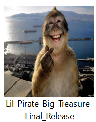

# Lil’ Pirate, Big Treasure 

# YouTube Gameplay

Watch the gameplay here (Alpha game):
[https://www.youtube.com/watch?v=YOUR_VIDEO_ID](https://youtu.be/AfDlUqmPtjY)

Watch the gameplay here (Beta game):
https://youtu.be/54URGLVSUUI 

Watch the final game here : 
https://youtu.be/2mIeDKcE81g 

# Publish Game in itch.io
this is the link to my game that i published in itch.io https://vathanak-thyrun.itch.io/ 

# Game Icon

i just pick a random picture in my gallery to use as my icon game

# Current Feature
- Player movement (move left, right, jump, double jump, dash)
- Fight animation
- Enemies
- Health system
- Pick up coin
- checkpoint
- death system
- life system
- Menu (Resume, restart, quit)
- Finish checkpoint
- total point when finish the game

# Asset
- Itch.io : Treasure Hunter, Author: Pixel Frog(https://pixelfrog-assets.itch.io/treasure-hunters)
- Itch.io : Rocky Roads, Author: Essssam(https://essssam.itch.io/rocky-roads)
- Itch.io : Pirate Bomb, Author: Pixel Frog(https://pixelfrog-assets.itch.io/pirate-bomb)

# Music & SFX
- Background Music by Ni Sound (https://artlist.io/sfx/track/big-screen-loops---walk-in-the-park-8-bit-melody-bright-positive/93714)
- All SFX : (https://www.myinstants.com/en/search/?name=meme)

# Used AI
ChatGPT :
- Prompt :
  1. fix my code i cannot modify my speed and jump
  2. why my character not respawning on the place that i put my checkpoint, it respawn somewhere else
  3. why my Idle, Run, Jump, Fall animation not working after i add attack animation
  4. this is my enimies code, why the animation when it die not working
  5. this is my set up, when i kill it the die animation is still not working
  6. how to make the screen shake only when it in my camera player
  7. currently i create a new enemies that look big. i want something like every time it walk my screen shake a little bit. can you guide me
  8. how to add sound effect to my enemies
  9. how to minimize my godot game
  10. what reqirement that i should have to publish my game in itch.io
  

